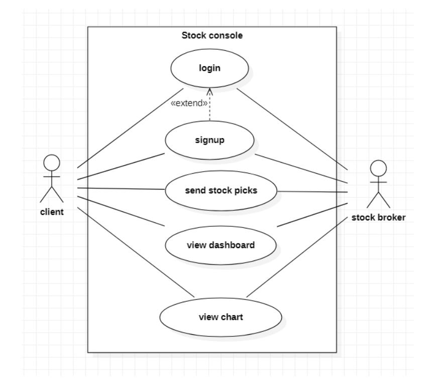

# Stock Console Mobile Application

### Download Apk <a href="https://drive.google.com/file/d/1frx5hYxEmIwY4F0U7uGu0M5Kgii7D27t/view?usp=sharing">stockconsole</a>

# Description


The stock console is where we can View and track our portfolio of stocks. It consists of a login page
followed by the central dashboards which displays all our buyings, its current value, Total amount
invested, Profit &amp; Loss and a page to place an order to buy new stocks . A single chart to display stock
price changes.

# Applications Used

```
Database : Firebase
Login and Authentication : Firebase
News API : https://newsapi.org
Language : Flutter
```


# Sequence Diagram

Login & Signup


Place order


 
<br>

Use Case Diagram - Stock console
<br>



## Page 1 - Login
<br>


## Page 2 - Signup
<br>


## Page 3 - Market Overview
<br>


## Page 4 - Place order
<br>


## Page 5 - Buy
<br>


## Page 6 - Sell
<br>


## Page 7 - Singlechart view
<br>


## Page 8 - Portfolio
<br>


## Page 9 - News
<br>


## Page 10 - News view
<br>


# Getting Started

This project is a starting point for a Flutter application.

A few resources to get you started if this is your first Flutter project:

- [Lab: Write your first Flutter app](https://flutter.dev/docs/get-started/codelab)
- [Cookbook: Useful Flutter samples](https://flutter.dev/docs/cookbook)

For help getting started with Flutter, view our
[online documentation](https://flutter.dev/docs), which offers tutorials,
samples, guidance on mobile development, and a full API reference.
